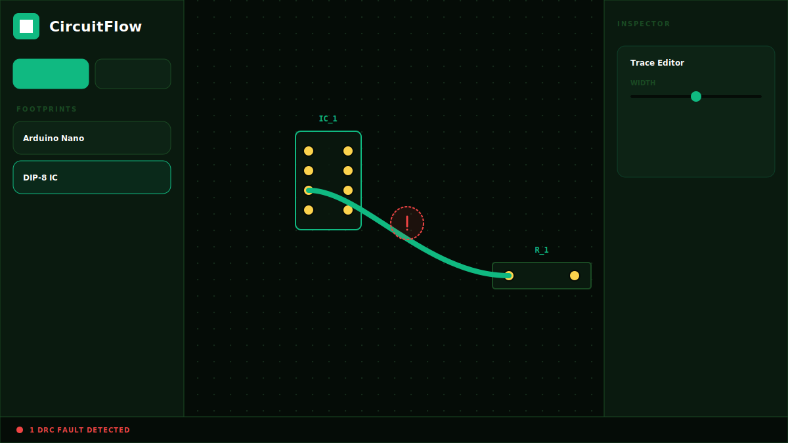

# ⚡ CircuitFlow

### Precision PCB Design for iPad & Desktop
**CircuitFlow** is a lightweight, high-performance PCB design tool optimized for through-hole prototyping. Designed for engineers and makers who need to move quickly from a breadboard concept to a CNC-milled PCB.

---

## 📸 Interface Preview

  
  
<i>The CircuitFlow Bezier routing engine and real-time Design Rule Check (DRC) system.</i>

---

## 🚀 Key Features

### 1. Curved Trace Engine
Forget rigid 45-degree angles. CircuitFlow uses **Cubic Bezier curves** for all routing, allowing for organic, high-performance layouts that minimize signal reflections and look stunning.

### 2. SVG-Matrix Precision
The app implements a custom coordinate mapping system using `getScreenCTM`. This ensures that every tap on an iPad or click on a 4K monitor is accurate to the sub-pixel, regardless of your current zoom level or pan position.

### 3. Real-Time DRC (Design Rule Check)
The background DRC engine constantly monitors your board for:
*   **Clearance Violations**: Ensures traces aren't too close to unrelated pads.
*   **Trace Collisions**: Prevents short circuits between different nets.
*   **Visual Feedback**: Glowing red markers pulse over problematic areas instantly.

### 4. CNC Ready
Directly export your design to **GRBL-compatible G-Code**. 
*   **Drill Cycles**: Automatic G0/G1 drilling blocks for all through-hole pads.
*   **Milling Paths**: High-precision subdivided Bezier paths for trace isolation.

---

## 🛠 Tech Stack

- **Framework**: React 19 (ESM)
- **Styling**: Tailwind CSS
- **Icons**: Lucide React
- **Engine**: Native SVG with coordinate matrix transformations
- **Mathematics**: Cubic Bezier interpolation and Euclidean distance collision detection

---

## 📖 How to Use

1.  **Select a Component**: Click any footprint in the left sidebar (e.g., Arduino Nano).
2.  **Place**: Tap anywhere on the grid to drop the part. Parts snap to a 2.54mm (0.1") grid.
3.  **Route**: Click any yellow pin and drag to another pin. A curved yellow preview will guide you.
4.  **Inspect**: Click a trace to reveal its **Track Width** slider in the right sidebar.
5.  **Check**: Hit the **Run DRC Check** button to verify your board health.
6.  **Export**: Click **Export GRBL** to download a `.nc` file ready for your CNC machine.

---

Developed with ❤️ by Senior Frontend Engineering.
